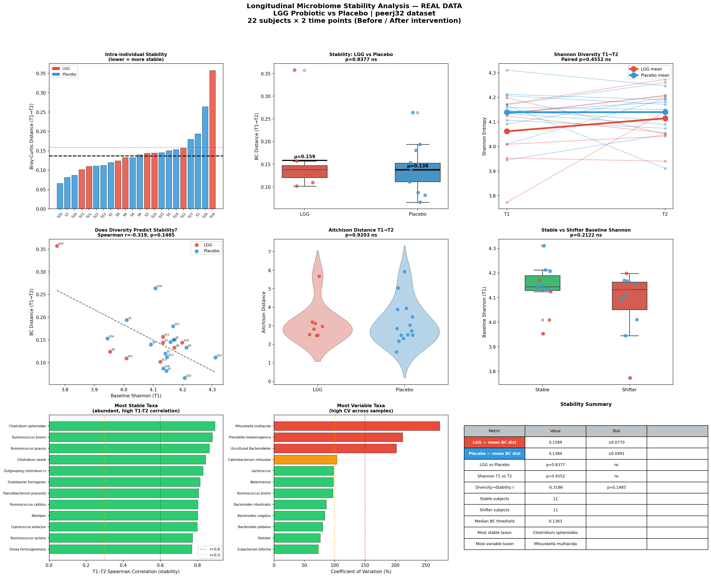

# Day 08 — Longitudinal Microbiome Stability Analysis
### 🧬 30 Days of Bioinformatics | Subhadip Jana


> Measuring gut microbiome stability at the subject level across a probiotic intervention — tracking which individuals are "stable" vs "shifters" and which taxa are most resilient.

---

## 📊 Dashboard


---

## 🔬 Dataset Structure (peerj32)
| Feature | Value |
|---------|-------|
| Subjects | 22 unique individuals |
| Time points | T1 (before) + T2 (after intervention) |
| Groups | LGG probiotic (8 subjects) vs Placebo (14 subjects) |
| Stability metric | Intra-individual Bray-Curtis distance (T1→T2) |

---

## 📈 Key Results

| Metric | LGG | Placebo | p-value |
|--------|-----|---------|---------|
| Mean BC distance (T1→T2) | 0.159 | 0.138 | 0.838 ns |
| Mean Aitchison distance | — | — | ns |
| Shannon T1→T2 change | +0.020 | — | 0.455 ns |

| Classification | Count |
|----------------|-------|
| Stable subjects | 11 |
| Shifter subjects | 11 |

**Key findings:**
- Gut microbiome was **highly stable** overall across the intervention (low BC distances)
- LGG and Placebo groups showed **similar stability** (p=0.84) — probiotic did not destabilize the gut
- Higher baseline diversity **trends toward more stability** (r=−0.32), though not significant in this small cohort
- Clostridium and Ruminococcus species were the **most stable taxa** (T1–T2 r > 0.88)
- Bacteroides species showed the **most inter-individual variability**

---

## 🏆 Most Stable Taxa (T1–T2 Spearman r)

| Taxon | T1–T2 r | CV (%) |
|-------|---------|--------|
| *Clostridium sphenoides* | 0.894 | 33.5 |
| *Ruminococcus bromii* | 0.880 | 97.0 |
| *Ruminococcus gnavus* | 0.863 | 38.0 |
| *Clostridium nexile* | 0.844 | 37.7 |

---

## 🚀 How to Run
```bash
pip install pandas numpy matplotlib seaborn scipy
python longitudinal_stability.py
```

---

## 📁 Structure
```
day08-longitudinal-stability/
├── longitudinal_stability.py
├── data/
│   ├── otu_table.csv
│   └── metadata.csv
├── outputs/
│   ├── stability_results.csv
│   ├── taxon_stability.csv
│   └── longitudinal_stability_dashboard.png
└── README.md
```

---

## 🔗 Part of #30DaysOfBioinformatics
**Author:** Subhadip Jana | [GitHub](https://github.com/SubhadipJana1409) | [LinkedIn](https://linkedin.com/in/subhadip-jana1409)
